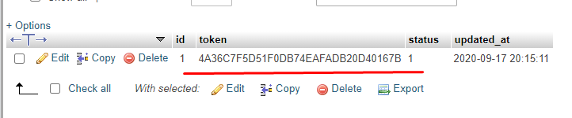
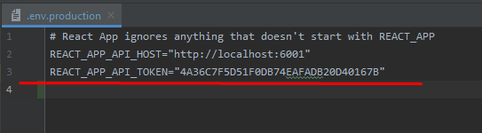

# Loco Express

### Overview
   * This project is split in two parts: `server` and `client`
        * Server
			- NodeJS Vesion >= 12.16 (Language)
			- Express (WEB Server)
			- Sequelize (ORM)
			- Passport (Authorization check)
			- This project is using DB MySQL
			
		* React
			- React (Framework)
			- material-ui
			- axios (Request)
			- moment (Datetime)
			- react-country-flag (Country Flags)	
			- react-flexbox-grid (Help for the responsive layout)
			
### Installation
   * Import the file `dump.sql` into the MySQL DB
        * Create the Database, please check the collation Encoding `utf8_general_ci` OR `utf8mb4_general_ci`
        * If you have any issue with the Authorization between client and server API, please have check the two files on client folder `.env.production` AND `.env.development`
        * Inside the client folder .env files have a look the variable `REACT_APP_API_TOKEN` for Token that should have this token in the table `token` on DB also check the variable `REACT_APP_API_HOST` to point to the correct server api.
        
        
        
        
   
   
   * Configure the files `.env` using the example file `.env.dist` inside the `server` folder
   * Execute the command `npm install` inside the `client` folder 
   * Execute the command `npm install` inside the `server` folder 
   
### Run Client DEV
   * Inside the `client` folder
   * Run the command `npm run start` or `npm start`, to start the development envarioment
     
### Run Server DEV
   * Inside the `server` folder
   * Run the command `npm run dev` using nodemon, to start the development envarioment
   
### Test Server
   * Inside the `server` folder
   * Run the command `npm run test`
   
   ** There is few tests, not for all code, this is just for you can analyze 
